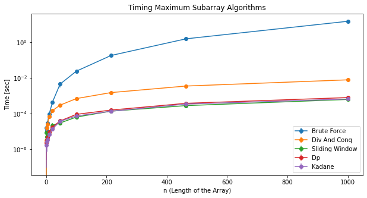

# The Maximum Subarray Sum Problem

Today, we are going to solve the famous [maximum subarray sum problem](https://leetcode.com/problems/maximum-subarray/). The problem is stated as:

```
Given an integer array nums, find the contiguous subarray (containing at least one number) which has the largest sum and return its sum. 
```

This problem is usually efficiently solved with Kadane's algorithm (a name for a specific dynamic programming algorithm). However, there are many ways to solve the maximum subarray problem. We will solve this problem with the following techniques:
1. Brute Force
2. Divide and Conquer
3. Dynamic Programming
4. Kadane's algorithm
5. Sliding Window

I will explain each technique, give its time and space complexity, and provide a python implementation of it. Then I will compare all of the different technqiues and plot their runtime on different inputs.

# Brute Force

**Idea:** Generate all possible subarrays from the original array and find the one that has the greatest sum.

**Time Complexity:** $O(n^2)$

The two nested for loops call line 6 of the algorithm $n (n+1)/2$ times, meaning we have a runtime of $O(n^2)$.

**Space Complexity:** $O(1)$

Trivial.


```python
def max_subarray_brute_force(nums):
  """compute the maximum subarray with a brute force technique"""

  max_sum = -float('inf')
  for i in range(len(nums)):
    for j in range(i, len(nums)):
      max_sum = max(max_sum, sum(nums[i:j+1]))
  return max_sum
```

# Divide And Conquer

**Idea:** Let the contiguous array that results in the maximum sum be dennoted by `nums[i, ..., j]`. Then if we are looking at the array `nums[low, ..., high]`, we know that the maximum subarray `nums[i, ..., j]` must be located in exactly one of three cases:
1. entirely in the subarray `nums[low, ..., mid]` so that $low \leq i \leq j \leq mid$
2. entirely in the subarray `nums[mid+1, ..., high]` so that $mid+1 \leq i \leq j \leq high$
3. crossing the midpoint so that $low \leq i \leq mid < j \leq high$

where `mid = (l + r) // 2`.

We can find the maximum subarrays of `nums[low, ..., mid]` and `nums[mid+1, ..., high]` recursively because these two problems are smaller instances of the original problem of finding a maximum subarray. However, the problem of finding a maximum subarray that crosses the midpoint is *not* a smaller instance of our orignal problem because it has the added constraint that the subarray it chooses *must* cross the midpoint.

So the function `max_crossing_subarray()` will compute the maximum subarray that crosses the midpoint. It works by computing the left sum, the biggest possible sum we can get by starting at `mid` and repeatedly adding the number to the left of `mid`. Similarly, we compute the right sum, the biggest possible sum we can get by starting at `mid` and repeatedly adding the number to the right of `mid`. Then we add the left sum and right sum because together they are the greatest sums formed that must go through `mid`. This function returns the indices demarcating a maximum subarray that crosses the midpoint along with the sum of the values in this maximum subarray.

Lastly, `max_subarray_helper()` is a helper function that does most of the work organizing the three cases described above. It also returns the indices demarcating a maximum subarray that crosses the midpoint along with the sum of the values in this maximum subarray.

Formally, we can express this as a recurrence relation:

\begin{align*}
  dp[i][j]
  &=
  \begin{cases}
    0 & \text{if } i == j
    \\
    \max(dp[i][mid], dp[mid+1][j], \text{max\_crossing\_subarray}(i, mid, j, nums)) & \text{else}
  \end{cases}
\end{align*}
where 
1. $mid = i + (j - i) // 2$
2. $dp[i][j]$ is the maximum sum found in the subarray in `nums[i, ..., j]` (inclusive of $i,j$). 

To compute the maximum subarray sum, simply compute $dp[0][len(nums)-1]$.

**Time Complexity:** $O(n log n)$

Let $T(n)$ be the runtime of `max_subarray_helper()` on an array of length $n$. `max_subarray_helper()` has the recurrence relation $T(n) = 2T(n/2) + \Theta(n)$. The term $2T(n/2)$ comes from the two recursive calls that are each made on half the input, ie. on `nums[low, ..., mid]` and `nums[mid+1, ..., high]`. The term $\Theta(n)$ comes from calling `max_crossing_subarray()` which runs in linear time. Using the master method (outside the scope of this article), we find that $T(n) = O(n log n)$.

 **Space Complexity:** $O(1)$

Trivial. Note: this space complexity does not take into account the space used by the recursive stack.


```python
def max_crossing_subarray(low, mid, high, nums):
  """compute the maximum subarray that crosses the midpoint."""
    
  # get largest left sum that ends at m, ie get largest sum of the form nums[i:mid+1] for some i
  left_sum = -float('inf')
  sum_ = 0
  for i in range(mid, low - 1, -1):
    sum_ += nums[i]
    if sum_ > left_sum:
      left_sum = sum_
      max_left = i
          
  # get largest right sum that starts at m, ie get largest sum of the form nums[mid+1:j] for some j
  right_sum = -float('inf')
  sum_ = 0
  for j in range(mid+1, high+1):
    sum_ += nums[j]
    if sum_ > right_sum:
      right_sum = sum_
      max_right = j
  
  return (max_left, max_right, left_sum + right_sum)
```


```python
def max_subarray_helper(low, high, nums):
  """ find the maximum subarray in nums[low, ..., high] by recursively computing 
  the maximum subarray to the left of the midpoint, to the right of the midpoint,
  and crossing the midpoint"""

  if low == high: # base case
    return (low, high, nums[low])
  
  # compute the maximum subarray to left of mid, to the right of mid, and crossing mid
  mid = low + (high - low) // 2
  left_low, left_high, left_sum = max_subarray_helper(low, mid, nums)
  right_low, right_high, right_sum = max_subarray_helper(mid + 1, high, nums)
  cross_low, cross_high, cross_sum = max_crossing_subarray(low, mid, high, nums)
  
  if left_sum >= right_sum and left_sum >= cross_sum: # if left_sum is the biggest
    return left_low, left_high, left_sum
  if right_sum >= left_sum and right_sum >= cross_sum: # if right_sum is the biggest
    return right_low, right_high, right_sum
  return cross_low, cross_high, cross_sum
```


```python
def max_subarray_div_and_conq(nums):  
  """compute the maximum subarray with a divide and conquer technique"""
  
  low, high = 0, len(nums) - 1
  _, _, max_sum = max_subarray_helper(low, high, nums)
  return max_sum
```

# Dynamic Programming

**Idea:**
If we already know the largest sum in `nums[0:i]`, then the largest sum in `nums[0:i+1]` is `nums[0:i] + nums[i]` if `nums[0:i]` is positive. If `nums[0:i]` is negative, adding it to `nums[i]` would just make it smaller, so the largest sum in `nums[0:i+1]` is just `nums[i]`. This idea naturally lends itself to dynamic programming. In particular, this problem has the recurrence:

\begin{align*}
  dp[i]
  &=
  \begin{cases}
    0 & \text{if } i < 0
    \\
    nums[i] + dp[i-1] & dp[i-1] > 0
    \\
    nums[i] & \text{else}
  \end{cases}
\end{align*}
where $dp[i]$ is the maximum sum obtained from contigious subarrays in the first $i$ elements of `nums`. This recurrence relation can be written more succinctly as
\begin{align*}
  dp[i]
  &=
  \begin{cases}
    0 & \text{if } i < 0
    \\
    nums[i] + \max(dp[i-1], 0) & \text{else}
  \end{cases}
\end{align*}

We will implement a bottom-up solution to this dynamic programming problem, meaning we compute the maximum sum in the first element of `nums`, the first two elements of `nums`, the first three elements of `nums`, etc. At each iteration, we compute the maximum sum seen so far. 

To compute the maximum subarray sum, simply compute $dp[len(nums)-1]$.


**Time Complexity:** $O(n)$

It takes constant time to compute a single entry in the table $dp$. And because there are $n$ entries in the table, it will take $O(n)$ time to fill in the entire table.

**Space Complexity:** $O(n)$

The table has $n$ entries so this algorithim take $O(n)$ space.


```python
def max_subarray_dp(nums):
  """compute the maximum subarray with a dynamic programming technique"""

  dp = [0] * (len(nums))
  dp[0] = max_sum = nums[0]

  for i in range(1, len(nums)):
    dp[i] = nums[i] + max(dp[i-1], 0)
    max_sum = max(max_sum, dp[i])
  return max_sum
```

# Kadane's Algorithm

**Idea:** Kadane's algorithm is the exact same as the dynamic programming solution but it uses $O(1)$ space instead of $O(n)$ space. Recall the recurrence relation for this problem is
\begin{align*}
  dp[i]
  &=
  \begin{cases}
    0 & \text{if } i < 0
    \\
    nums[i] + \max(dp[i-1], 0) & \text{else}
  \end{cases}
\end{align*}
A closer analysis reveals that to compute $dp[i]$, we only need $dp[i-1]$. We don't need any of the other previous entries of $dp$. This means we do not to store the entire $dp$ table (which takes $O(n)$ space) and instead can store just $dp[i-1]$ as `current_sum`. This is Kadane's algorithm.

Again, to compute the maximum subarray sum, simply compute $dp[len(nums)-1]$.

**Time Complexity:** $O(n)$

We must compute $n$ different values of $dp$.

**Space Complexity:** $O(1)$

We only store only the previous sum to compute the current sum.


```python
def max_subarray_kadane(nums):
  """compute the maximum subarray with the Kadane's algorithm technique"""
  
  max_sum = current_sum = nums[0]
  for i in range(1, len(nums)):
    current_sum = nums[i] + max(current_sum, 0)
    max_sum = max(max_sum, current_sum)
  return max_sum
```

# Sliding Window

**Idea:** Use two pointers `low` and `high` to maintain a sliding window across the array. At every iteration, move `high` one to right and add the new element to the running sum `sum_`. If the sum is less than the new element `nums[high]`, then we would get a higher sum just by starting our sum from `nums[high]`. So we want to keep on moving the left pointer until `sum_ < nums[high]` is no longer true; this is expressed with a while loop. (A closer look reveals that if we ever have `sum_ < nums[high]` and wish to start our sum from `nums[high]`, we can immediately move the left pointer to `nums[high]` if `sum_ < nums[high]`, no need for a while loop; this optimized version is commented out. Also, at every iteration we record the maximum sum so once we're done iterating through the array, we can just return the maximum sum.

**Time Complexity:** $O(n)$

We iterate through the entire array once by moving two pointers.

**Space Complexity:** $O(1)$

Trivial.


```python
def max_subarray_sliding_window(nums):
  """compute the maximum subarray with a sliding window technique"""

  low, sum_ = 0, 0
  max_sum = -float('inf')
  
  for high in range(len(nums)):
    sum_ += nums[high]
    
    while sum_ < nums[high]:
      sum_ -= nums[low]
      low += 1

    # optimized version
    # if sum_ < nums[high]:
    #   sum_ = nums[high]
    #   low = high
  
    max_sum = max(max_sum, sum_)
  return max_sum
```

# Comparison

**Time & Space Complexity:** We can easily analyse the space and runtime complexity of each algorithm.

|Technique|Runtime  &nbsp;|Space|
|---------------|------------|--|
|Brute Force|$O(n^2)$|$O(1)$|
|Divide & Conquer|$O(n logn)$|$O(1)$|
|Sliding Window|$O(n)$|$O(1)$|
|Dynamic Programming|$O(n)$|$O(n)$|
|Kadane's Algorithm|$O(n)$|$O(1)$|

**Sliding Window & Kadane's Algorithm:** If you take a closer look, you can see that Sliding Window and Kadane's Algorithm are essentially the same exact algorithm but implemented differently.

**Recurrence Relations:** Note that DP/Kadane's algorithm can be expressed by the recurrence relation
\begin{align*}
  dp[i]
  &=
  \begin{cases}
    0 & \text{if } i < 0
    \\
    nums[i] + \max(dp[i-1], 0) & \text{else}
  \end{cases}
\end{align*}
but the divide and conquer technique can be expressed by the recurrence relation
\begin{align*}
  dp[i][j]
  &=
  \begin{cases}
    0 & \text{if } i == j
    \\
    \max(dp[i][mid], dp[mid+1][j], \text{max\_crossing\_subarray}(i, mid, j, nums)) & \text{else}
  \end{cases}
\end{align*}

Both recurrences display optimal substructure, meaning the solution to the original problem can be achieved by finding the optimal solution to smaller subproblems. Yet there are differences. The first recurrence is 1D while the second recurrence is 2D. This explains why the first recurrence results in an $O(n)$ algorithm and the second recurrence results in an $O(n log n )$ algorithm.


# Timing Maximum Subarray Algorithms

The table above states the worst case runtime of various maximum subarray algorithms. However, how many seconds does it actually take to compute the maximum subarray sum for each algorithm? How much faster is one algorithm than another? 

Below I run the five different maximum subarray algorithms and time their runtime on inputs of different sizes. Every element of the input array is randomly (uniformly) choosen from the interval $[-100, 100]$. Scroll past the code to see the results.


```python
import pandas as pd
from functools import partial
import timeit
import numpy as np
import matplotlib.pyplot as plt
```


```python
def get_inputs(seed, sizes, lower=-100, upper=100):
  inputs = []
  rng = np.random.default_rng(seed)
  for size in sizes:
    inputs.append(rng.integers(lower, upper, size=size))
  return inputs
```


```python
def get_timings(functions, inputs, repeats, n_tests):
  for func in functions:
    result = pd.DataFrame(index = map(len, inputs), 
                          columns = range(repeats),
                          data = (timeit.Timer(partial(func, i)).repeat(repeat=repeats, number=n_tests) for i in inputs)
                          )
    yield func, result
```


```python
def aggregate_results(timings):
    empty_multiindex = pd.MultiIndex(levels=[[],[]], codes=[[],[]], names=['func', 'result'])
    aggregated_results = pd.DataFrame(columns=empty_multiindex)

    for func, timing in timings:
      func_name = func.__name__[13:].replace('_', ' ').title()
      for measurement in timing:
          aggregated_results[func_name, measurement] = timing[measurement]
      aggregated_results[func_name, 'avg'] = timing.mean(axis=1)
      aggregated_results[func_name, 'yerr'] = timing.std(axis=1)

    return aggregated_results
```


```python
def plot_results(results):
    fig, ax = plt.subplots(figsize=(10, 5))
    x = results.index
    for func in results.columns.levels[0]:
        y = results[func, 'avg']
        yerr = results[func, 'yerr']        
        ax.errorbar(x, y, yerr=yerr, fmt='-o', label=func)

    ax.set(xlabel='n (Length of the Array)', 
           ylabel='Time [sec]', 
           title='Timing Maximum Subarray Algorithms',
           yscale='log'
           )
    ax.legend()    
    return fig, ax
```


```python
def plot_times(functions, inputs, repeats=3, n_tests=1):
    timings = get_timings(functions, inputs, repeats=repeats, n_tests=n_tests)
    results = aggregate_results(timings)
    fig, ax = plot_results(results)

    return fig, ax, results
```


```python
seed = 0
max_input_length_power = 3 # the largest size the input array will take on is 10 raised to this power
sizes = np.logspace(0, max_input_length_power, num=10).astype(int)
inputs = get_inputs(seed, sizes)
```


```python
functions = [max_subarray_brute_force,
             max_subarray_div_and_conq,
             max_subarray_sliding_window,
             max_subarray_dp,
             max_subarray_kadane
             ]

fig, ax, results = plot_times(functions, inputs)
```


    

    


Note that, as expected, the $O(n^2)$ brute force algorithm is the slowest, the $O(n log n)$ divide and conquer algorithm is the second slowest, and the $O(n)$ sliding window algorithm, (non-constant space) dynamic programming algorithm, and Kadane's algorithm are the fastest. This emperically confirms what we showed via theory.

# Works Cited

1. Cormen, Thomas H, et al. Introduction to Algorithms. 3rd ed., Cambridge (Massachusetts) ; London, MIT Press, 2007, pp. 68–74.
2. Fabré, Maarten. “Plot Timings for a Range of Inputs.” Code Review Stack Exchange, 9 June 2017, codereview.stackexchange.com/a/165362/260966. Accessed 25 July 2022.
3. Leetcode. “Maximum Subarray.” Leetcode.com, leetcode.com/problems/maximum-subarray/discuss/. Accessed 25 July 2022.
